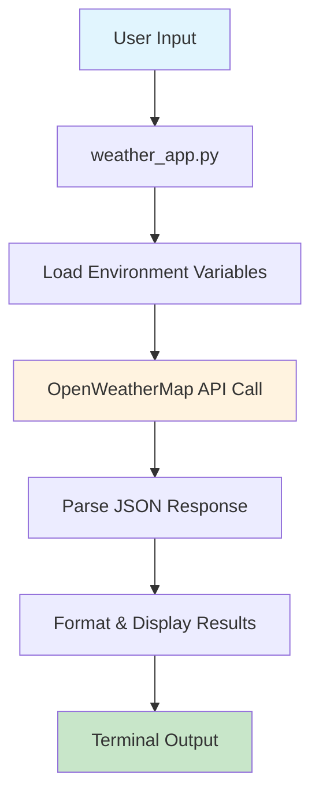

# Weather CLI App 🌤️

A simple command-line weather application that fetches real-time weather data using the OpenWeatherMap API.

## Architecture



## Features

- 🌡️ Current temperature in Fahrenheit
- 💧 Humidity percentage  
- ☁️ Weather description
- 🏙️ City and country information
- 💻 Pure command-line interface
- 🚀 Fast and lightweight

## How to Run the CLI App

```bash
python weather_app.py
```

The app will prompt you to enter a city name and display the weather information.

## Setup Instructions

### 1. Install Dependencies
```bash
pip install -r requirements.txt
```

### 2. Get an API Key
1. Visit [OpenWeatherMap](https://openweathermap.org/)
2. Sign up for a free account  
3. Go to API keys section and copy your key

### 3. Configure Environment
Create a `.env` file in the root directory and add your API key:
```
OPENWEATHER_API_KEY=your_actual_api_key_here
```

## Python Version

This application is built and tested with **Python 3.7+**

## Example Output

```
🌤️  Welcome to Weather CLI App!
🏙️  Enter a city name: Miami
🔍 Fetching weather data for Miami...

==================================================
🌤️  WEATHER REPORT FOR MIAMI, US
==================================================
🌡️  Temperature: 83.3°F
💧 Humidity: 78%
☁️  Description: Partly Cloudy
==================================================
```

## Dependencies

- `requests==2.31.0` - HTTP requests for API calls
- `python-dotenv==1.0.0` - Environment variable management

## License

This project is open source and available under the MIT License.
