# 🌤️ Weather CLI App

A simple command-line interface application to fetch and display current weather data for any city.

## How It Works

The app follows a simple, one-time interaction flow:

```mermaid
sequenceDiagram
    participant U as 👤 User
    participant A as 🐍 CLI App
    participant W as 🌐 API

    Note over U, A: One-Time Command
    U->>A: Runs script
    A->>U: "🏙️ Enter city name"
    U->>A: Types "London"
    A->>W: 🔍 Fetches weather
    W->>A: Sends data
    A->>U: 📊 Prints report
```



## Setup

1.  **Get an API Key:** Sign up for a free account at [OpenWeatherMap](https://home.openweathermap.org/users/sign_up) to get your API key.

2.  **Configure Environment:**
    ```bash
    cp .env.example .env
    # Edit .env and add your actual API key:
    # OPENWEATHER_API_KEY=your_actual_api_key_here
    ```

3.  **Install Dependencies:**
    ```bash
    pip install -r requirements.txt
    ```

## Usage

Run the application directly:
```bash
python weather_app.py
```

You will be prompted to enter a city name. The app will then fetch and display the current weather conditions.

## License

This project is open source and available under the MIT License.
